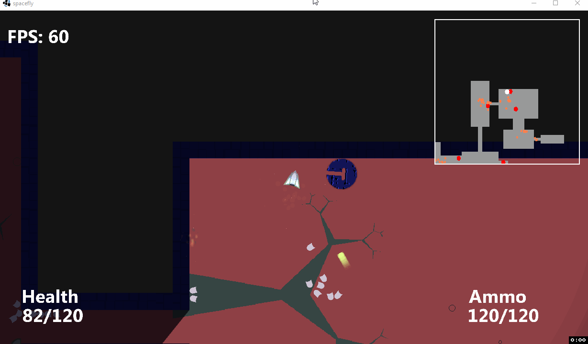
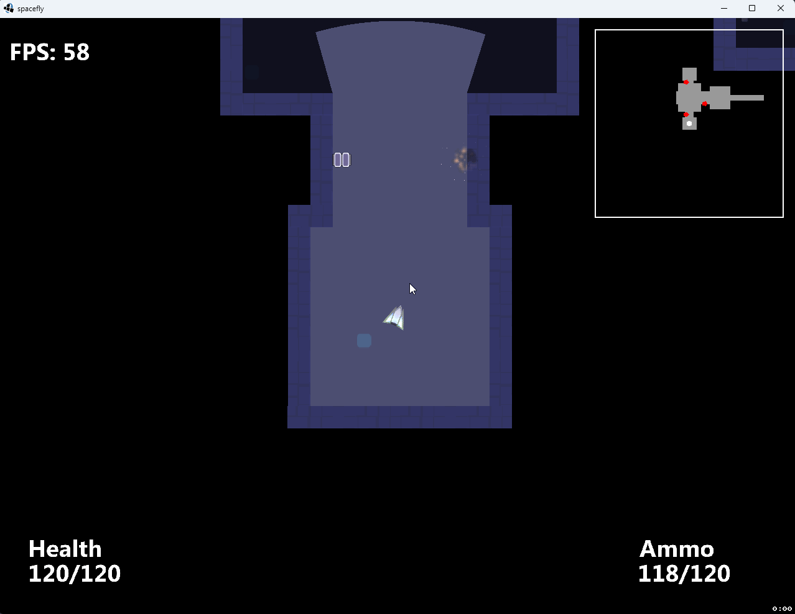

# Spacefly - 2D game

* Java
* LibGDX
* Procedurally generated levels
* Box2D for collision detection
* 2D visibility polygon calculation
    * Loosely follows the method described in "Efficient Computation of Visibility Polygons" by F Bungiu et al.

Screenshot: 

## Dependencies

LibGDX 1.10.0